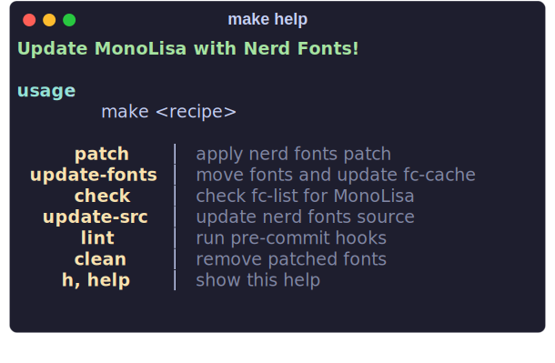

# MonoLisa NF

_Most_ Batteries included repo to patch MonoLisa with Nerd Fonts glyphs

tested w/ MonoLisa-Basic-2.012

<p align="center">

</p>

## Getting Started

### Dependencies

- `python`
- `make` (optional)
- `fontforge` OR `docker`

There are some caveats to invoking the `font-patcher` script.
Some of which are explained by [nerd fonts](https://github.com/ryanoasis/nerd-fonts#font-patcher).
To use `font-patcher` with `fontforge` first ensure it is installed (or see below for `docker` approach).

On Arch:
```bash
sudo pacman -S fontforge
```

You can also download the version for your system from the releases in the fontforge [repo](https://github.com/fontforge/fontforge).

If you prefer to use `docker` rather than install `fontforge` you can add `ARGS='--docker'` to calls to `make patch`.

Next you may clone the repo to fetch the needed symbols/scripts for patching:

```bash
git clone --depth 1 git@github.com:daylinmorgan/monolisa-nerdfont-patch.git
```

## Downloading MonoLisa

Once you have acquired MonoLisa, follow the link in your email to download it.
Then extract the `.zip` file of the type you've downloaded into `MonoLisa/`.

The expected directory structure is below.
You only need to download the font types you plan to use.

```bash
MonoLisa
├── otf
├── ttf
├── woff
└── woff2
```

## Patching your font

Once you have downloaded MonoLisa and `fontforge`
you can easily apply the nerd font patches with `make`.

To patch all font types use the default `patch` rule.

```bash
make # or ./patch-monolisa -f MonoLisa -c
```

By default the complete (`-c`) flag is passed to the font-patcher script to include all icons/symbols.
You can change this by specifying the `ARGS` at runtime.

```bash
ARGS="-c -w" make patch
```

See `./patch-monolisa --help` and `./bin/font-patcher --help` for available `ARGS`.

You can find your patched fonts in the `patched/` directory

If like me you want to place your patched fonts in a standard location on your Unix system you can move them to `~/.local/share/fonts/MonoLisa` with the `bin/update-fonts` script.

Or for simplicity you can copy the fonts and update the cache with:

```bash
make update-fonts
```

You can verify the fonts have been added with `make check`.

## with Nix

You can run using the included `flake.nix`.

```bash
nix run "github:daylinmorgan/monolisa-nerdfont-patch"
```

## Contributing

Before making changes to to any of the scripts in `bin` you should first install `pre-commit`.
Followed by setting up the `pre-commit` hooks locally.

```bash
pipx install pre-commit
pre-commit install
```

## Special Thanks

- [MonoLisa](https://www.monolisa.dev)
- [Nerd Fonts](https://www.nerdfonts.com)
